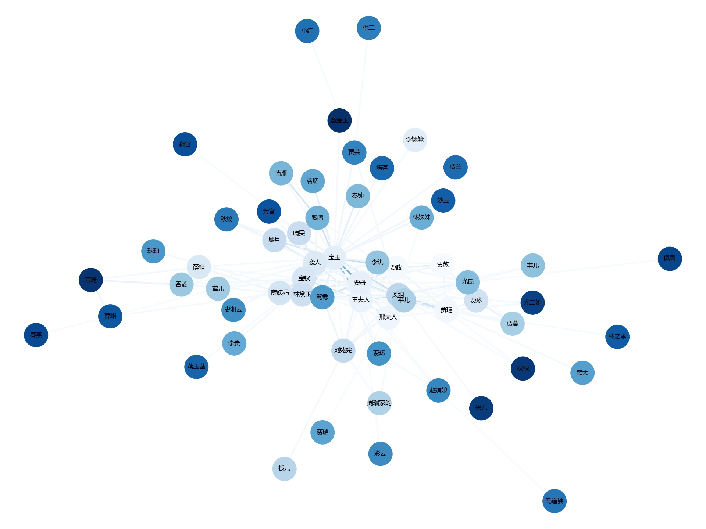

# 《红楼梦》简单的数据分析

这是Python期中的一个作业，主要是对《红楼梦》做一些简单的数据分析并进行可视化。小说是从网上下载，并未切分章节，得自己进行切分。

本仓库还用了额外的两个数据：```character.txt```是小说中的登场人物，并有“nr”标签，帮助结巴分词的时候更加准确。```relative.json```是从[https://github.com/DesertsX/gulius-projects](https://github.com/DesertsX/gulius-projects)下载过来的，里面有提取好的人物关系，方便我们使用。（如有侵权行为请联系删除）

## 人物词云

根据小说中角色的登场人物来制作词云。使用的工具是```pyecharts```，直接生成html进行查看。

## 每种人物关系的次数

根据```relative.json```，统计每种人物关系出现的次数。使用的工具是`pyecharts`，直接生成html进行查看。

## 每一回出场次数最多的任务

每一回出场次数最多的角色 ，用柱状图进行可视化。

## 根据共现关系画图谱

根据共现关系画出图谱 ，以每两个句子作为一个窗口，识别窗口内的角色 。将这些角色bi-gram进行分组，创建节点，边则为二者共现次数 ，边颜色越深，共现越频繁，证明人物关联越密切。使用的工具是```networkx```。




## 使用neo4j制作人物关系图谱


## 判断红楼梦作者归属

传闻中红楼梦前80回和后40回不属于同一个作者。这里使用的是K-means聚类进行简单的判断。参考文章：[https://juejin.im/post/5b09945cf265da0dc562f316](https://juejin.im/post/5b09945cf265da0dc562f316)。对文章提取关键词（每个章节1000个，并去除角色名，因为剧情前后变化可能会有影响），并用```sklern```中的方法进行向量化。聚类后使用PCA降维，使用```matplotlib```可视化聚类效果。


